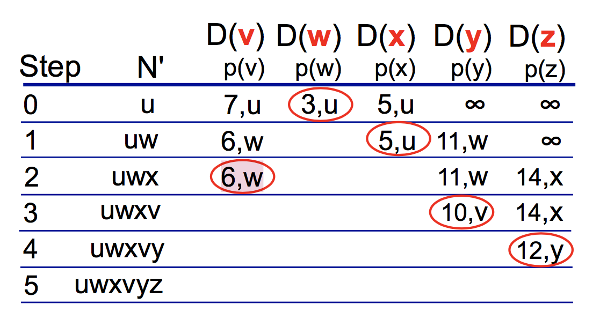
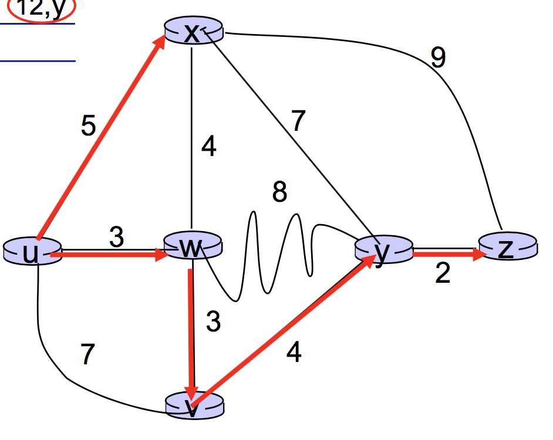
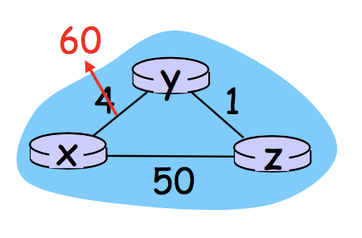

## link state vs. distance vector

### 1. LS algorithm 链路状态路由选择算法

> global, iterative

- 结点广播的结果是所有节点具有了网络的等同的、完整的视图
- 基本思想：给定一个源u，用dijkstra算法得到从u到所有其他结点的最短距离和最短路径的上一跳结点

Goal: x ==> z

算完以后，得到x==>z的最短路径是 u - w - v - y - z

每个***路途中的***结点都有了自己的一个***相应***forwarding table：

u的forwarding table：

| destination | 下一跳结点 |
| ----------- | ---------- |
| x           | (u, x)     |
| w           | (u, w)     |
| v           | (u, w)     |
| y           | (u, w)     |
| z           | (u, w)     |

w的forwarding table：

| destination | 下一跳结点 |
| ----------- | ---------- |
| x           | --         |
| u           | --         |
| v           | (w, v)     |
| y           | (w, v)     |
| z           | (w, v)     |

v的forwarding table：

| destination | 下一跳结点 |
| ----------- | ---------- |
| x           | --         |
| u           | --         |
| w           | --         |
| y           | (v, y)     |
| z           | (v, y)     |

y的forwarding table:

| destination | 下一跳结点 |
| ----------- | ---------- |
| x           | --         |
| u           | --         |
| w           | --         |
| v           | --         |
| z           | (y, z)     |

该算法（LS）只进行了以u为源结点时的情况 复杂度就为 n(n+1)/2 ==> O(N^2)

若想得到**所有**结点的所有信息（即‘’--‘’都被补全），则需要把每一个结点当作源进行一次dijkstra。

:hear_no_evil:But, LS may have oscillations!!!

### 2. DV algorithm 距离向量路由选择算法

> decentralized, **iterative**, 异步的

**Bellman-Ford方程：Dx(y) = *min* { c(x,v) + Dv(y) }**

- 基本思想：每个结点x以Dx(y)开始，对在N中的所有结点，估计从它自己到结点y的最低费用路径的费用

  定义*距离向量Distance-Vector：*令**Dx** = [Dx(y): y *belongs to* N] 是结点x的距离向量，该向量是从x到在N中的所有其他结点y的费用估计的向量。

  使用DV算法，每个结点维护下列路由选择信息：

  - c(x,v)  v是x的邻居
  - Dx = [Dx(y): y *belongs to* N]  x的距离向量
  - Dv =  [Dv(y): y *belongs to* N]  每个邻居v的距离向量

  过程中： 每个结点不时地向它的邻居发送它的距离向量副本；

  ​		当x接收到一个新的距离向量Dv，它保存Dv，然后使用Bellman-Ford方程更新自己的距离向量Dx；

  ​		若Dx因更新被改变了，那么x接下来会像自己的邻居发送更新后的Dx.

:hear_no_evil:But DV may have count-to-infinity problem ("bad news travels slow") !!!

-    Dy(x)=min{c(y,x)+Dx(x),c(y,z)+Dz(x)}=min{60+0,1+5}=6 
-    Dz(x)=min(c(z,x)+Dx(x),c(z,y)+Dy(x)}=min{50+0,1+6}=7 
-    Dy(x)=8, Dz(x)=9,... totally 44 iteration! 

Solution: **Poisoned Reverse** 毒性逆转

If Z routes through Y to get to X :
   	Z tells Y its (Z’s) distance to X is infinite (so Y won’t route to X via Z).
 

